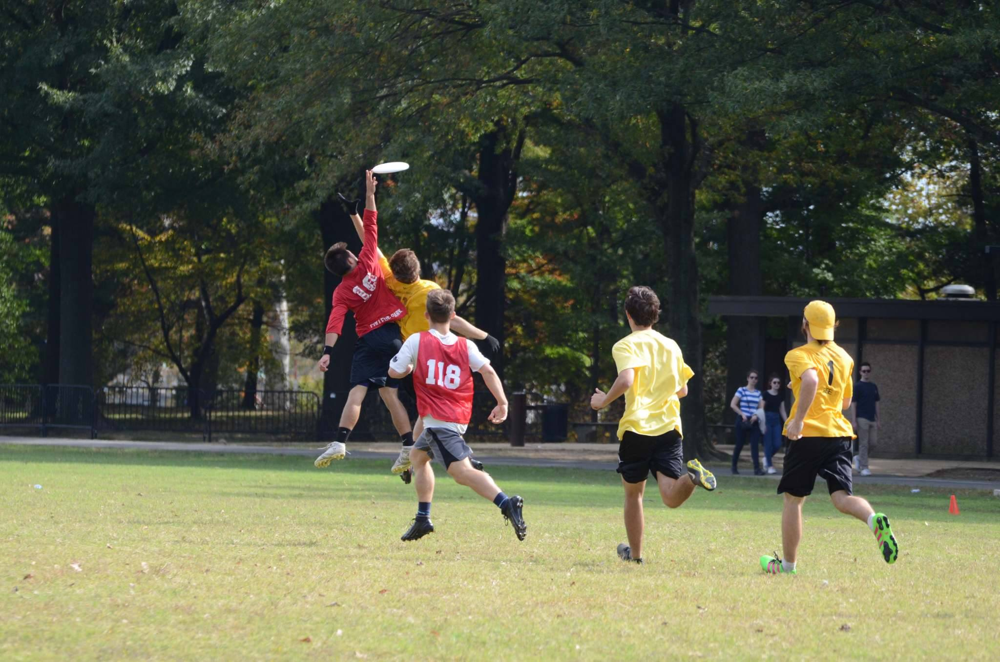
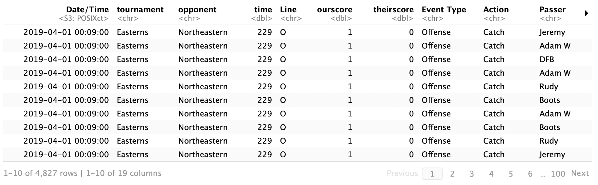
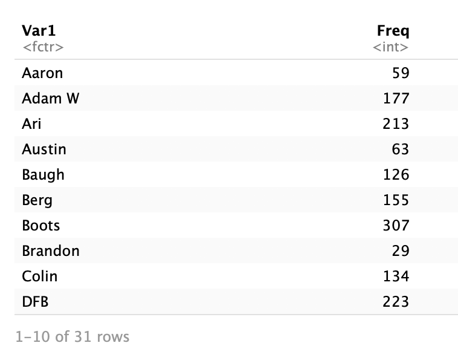
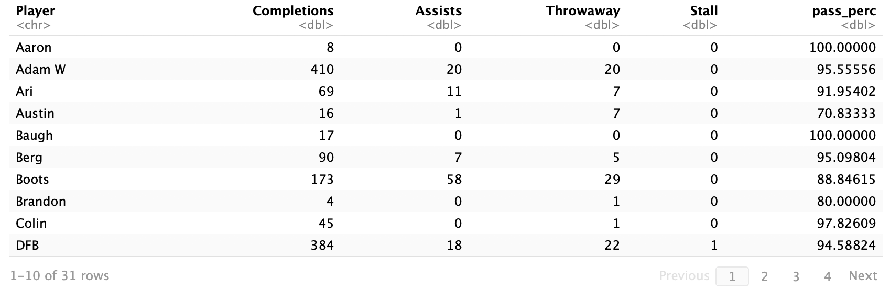
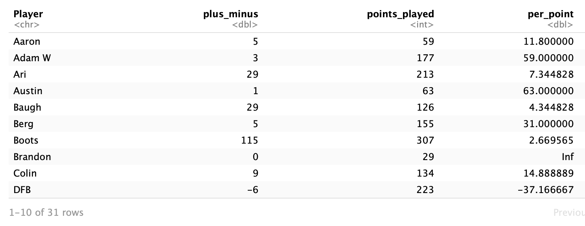
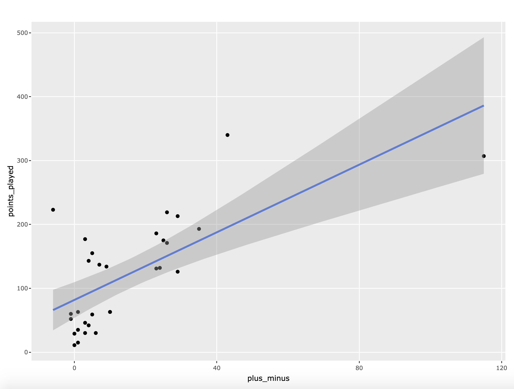
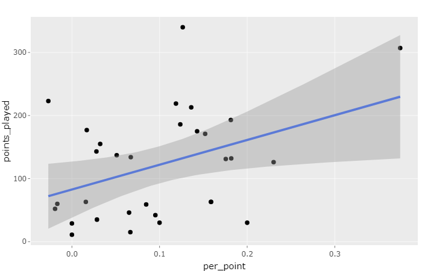
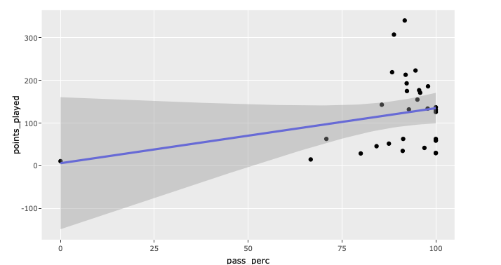
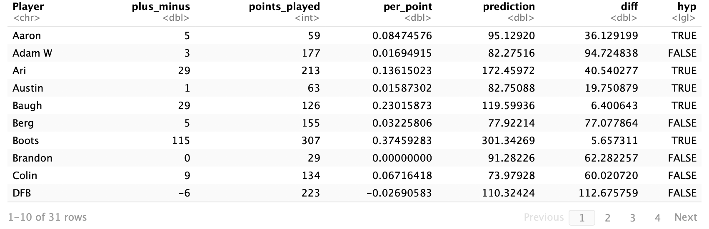
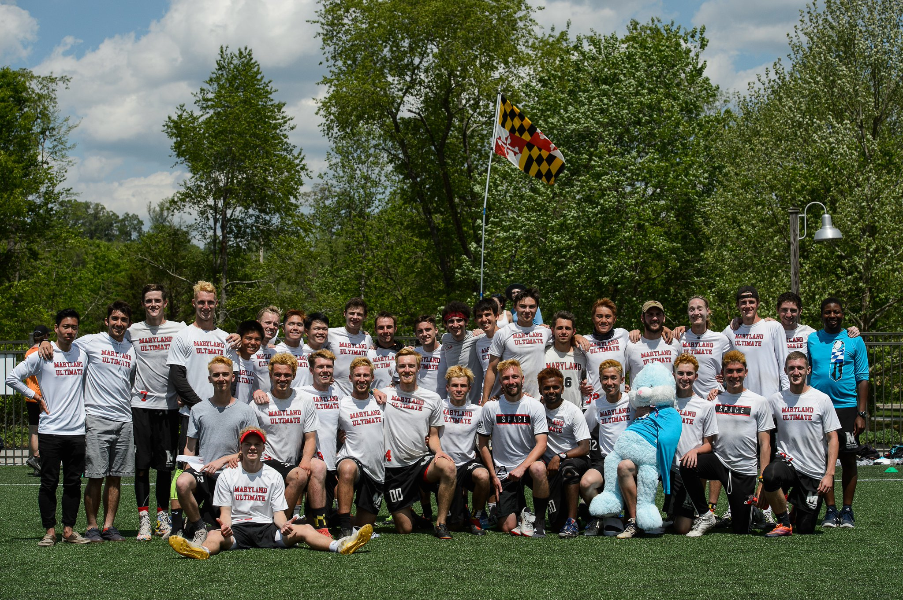

## Space Bastards: An Overview of Men's Club Ultimate, Spring 2019
#### By Catherine Heller, Jeremy Hess, and Rudra Menon
[Download CSV Team Stats for the Spring 2019 Season](SpaceBastards-stats.csv)

[Download Excel viewable Team Stats](SpaceBastards-stats.xlsx)

[Download R Markdown code for the experiment](FinalProject.Rmd)


Captain John Walden makes a sick grab over an opponent's head.

# Introduction
Frisbee has become a staple, if not a cliche, of the college experience.  For most, it’s just throwing a disc around on campus green spaces.  For others, it is a sport that hours of hardwork, dedication, sweat, and tears are poured into over four years, maybe even five.  Club Ultimate Frisbee takes the casual games and tossing that pop up sporadically to the next level.  Practicing up to eight hours a week, spending time outside of practice working out at the gym or getting in reps with a disc, traveling hundreds of miles away to compete against other schools all are essential parts of the club ultimate experience at the University of Maryland.  

The men's team at UMD is, for some unknown reason, named the [Space Bastards](http://umd.orgsync.com/org/ultimate).  To help them strategize and develop players, they made use of UltiAnalytics, a site that can track individual and team frisbee stats throughout the season.  They filmed all their games this semester, in order to rewatch them to either learn about opposing teams or collect their own stats and input them into the UltiAnalytics system.  Positive stats include goals and assists.  Negative stats include throwawys (throwing a disc to someone who doesn't catch it) and turnovers, which include drops and stalls (losing the disc because you held it for longer than 10 seconds).  All of these components come together to create a picture, through data, of the team's strengths and weaknesses.

For many, data science may seem only important or applicable to large companies, government agencies, or academic endeavors.  This tutorial is particularly important to the three of us, as all of us are members of the frisbee community here at UMD, with Jeremy Hess and Rudra Menon playing for Space Bastards and Catherine Heller playing for the women's team, Helpful Corn.  Throughout this tutorial, we hope to show that anyone, even college students, can use data science to learn about the intracacies of their sports interests and even better those sports experiences.  Even UltiWorld (essentially the ESPN of the frisbee world) sees the value of data science in improving game play and [has encouraged players to get involved.](https://ultiworld.com/2016/10/25/basic-team-analysis-using-four-metrics/)  In particular, this analysis and tutorial serves as an example for other college teams to make the most of their stats, find achieavable and worthwile goals, and improve their performance on the field.


# The Question

Overall in this endeavor, we sought to discover the answer to this question:

_"Do better players actually get more playing time?"_

While someone may seem to be very skilled in practice, therefore gaining them playing time during tournaments, stats show us if it translates onto the field come game time.  It would be unfortunate if unrecognized, good players were overlooked or if overstated players were relied on too heavily, taking up playing time when they should be benched or developed more.  Specifically, we focused on player performance while on offense, though there were still a myriad of offensive factors to consider when determining the value of each player on the field.  Through this analysis, we aimed to determine the relationship between some of these offensive stats and playing time.

# Data Curation

Retrieving this data was simple.  The team has been personally building this dataset up over the past few months.  Collecting the data just required us to download it from [UltiAnalytics](https://www.ultianalytics.com/details.html).

Here are some terms concerning our dataset that you should know going forward:
 - Action: any drop, stall, turn, assist or goal
 - Playing time: how many points a player participated in during the season.  This is not a measure of time (like minutes or hours) a player spent on the field, but rather how many times he was one of the seven people put on the line at the beginnning of a point.  If you're unfamiliar with the game flow of an ultimate frisbee game, [click here](https://www.youtube.com/watch?v=YkMMqOUNyKk) to learn more.
 - Passing percentage: how many throws a player successfully completed
 - Line: the seven players who are on the field for the Space Bastards during a single point.  The line changes from one point to the next.
 
```markdown
 {r part 1, RESULTS=HIDE}
stats <- read_csv("SpaceBastards-stats.csv")

stats <- stats %>%
  select("Date/Time", tournament = "Tournamemnt", opponent = "Opponent", time = "Point Elapsed Seconds", "Line", 
         ourscore = "Our Score - End of Point", theirscore = "Their Score - End of Point", "Event Type", "Action", 
         "Passer", rec = "Receiver", "Defender", p0 = "Player 0", p1 = "Player 1", p2 = "Player 2", p3 = "Player 3", p4 = "Player 4",
         p5 = "Player 5", p6 = "Player 6")

stats
```


# Parsing and Data Management
Once we had the data, we had to do a lot of cleaning and maniupulation to make the data usable, as it was not in the same format that it appeared in on the very user-friendly site.  We also had to make some new fields of our own.

The biggest portion of this step was dedicated to calculating the Plus-Minus value for each player on the team, the means with which we were able to rank all the players from best to worst.  Plus-Minus is a mechanism that takes positive actions on the field and balances them against negative actions on the field.  A coach or captain can put into the system how many drops or turns a player was responsible for, as well as their goals and assists.  Drops, turns, and stalls each count as -1, while goals and assists count as +1.  All these actions are added together to create the player's Plus-Minus score.

```markdown
{r part 2}
plusminus <- stats
plusminus$Player <- ifelse(is.na(plusminus$Passer), plusminus$Defender,
                      ifelse(plusminus$Action == "Drop", plusminus$rec, plusminus$Passer))

plusminus <- plusminus %>% rbind(plusminus %>%
                                   filter(Action=="Goal") %>%
                                   mutate(Action="Score", Player=rec))
plusminus <- plusminus %>%
  select(Player, Action, rec) %>%
  group_by(Player) %>%
  count(Action) %>%
  select(Player, Action, n)

rows <- dim(plusminus)[1]; plusminus <- plusminus[1:(rows - 6),] #Remove last 6 entries, not useful
plusminus <- plusminus%>% 
  group_by(Player) %>%
  spread(key="Action",value=n) %>% 
  filter(Player != "0" &  Player != "Anonymous")
plusminus[is.na(plusminus)] <- 0

plusminus$plus_minus <- plusminus$Callahan + 
 plusminus$D + plusminus$Goal+ plusminus$Score - 
 plusminus$Stall - plusminus$Throwaway - plusminus$Drop

plusminus %>% select(Player, plus_minus)
```

Additionally, we needed to calculate how many points each player played.  In order to get these numbers for each person, we had to analyze each line, both offense and defense, for each game of the season.
```markdown
library(slam)
points <- stats %>%
  select(tournament, opponent, ourscore, theirscore, p0, p1, p2, p3, p4, p5, p6) %>%
  group_by(tournament, opponent, ourscore, theirscore, p0, p1, p2, p3, p4, p5 ,p6) %>%
  count()

points <-points %>% 
  ungroup() %>% 
  select(p0, p1, p2, p3, p4, p5 ,p6)

points_played <- as.data.frame(table(unlist(points)))
points_played
```


We also calculated passing percentages (rate of completed throws per player) to visually compare against our plus-minus and points played relationship in the next step (Exploratory Data Analysis).

```markdown
passing<- plusminus %>% select(Player, Completions= "Catch", Assists="Goal", "Throwaway", "Stall")
passing$pass_perc <- (passing$Completions + passing$Assists)/ (passing$Completions + passing$Assists + passing$Throwaway + passing$Stall) * 100
passing
```


After all this data management, we put all the values we needed into one table.
```markdown
final_df <- plusminus
final_df$points_played <- points_played$Freq
final_df <- final_df%>%
  group_by(Player) %>%
  summarise_all(funs(first(na.omit(.)))) %>%
  select(Player, plus_minus, points_played)
final_df$per_point <- final_df$points_played / final_df$plus_minus
```


# Exploratory Data Analysis

[Exploratory Data Analysis](https://insidebigdata.com/2014/11/09/ask-data-scientist-importance-exploratory-data-analysis/) is a great tool for stepping beyond our assumptions about the data and into the numbers and trends themselves.  In this step of our experiment, we aimed to get a better idea of how the player's stats actually related to each other quantifiably. In our exploratory data analysis, we visualized three plots using scatter plots with a trend, comparing points played to three different measures: the plus-minus score, plus-minus score average per point, and passing percentage. 

First, we created a plot for plus-minus versus points played. This is a very direct correlation between playing time and plus-minus performance. From this, we could see if the players with higher or lower plus minuses are getting (or not getting) playing time accordingly. Interestingly enough, the highest plus-minus individual on the team falls below the trend for plus-minus to points played, whereas the second-highest individual lands way above the trend.

```markdown
plot <- final_df %>% ggplot(mapping = aes(label=Player, x=plus_minus, y=points_played)) +
  geom_point()+ 
  geom_smooth(method=lm) 


ggplotly(plot, tooltip = c("Player", "plus_minus","points_played"))
```



Second, we analyzed the per-points averages of players against their actual playing time. With the per-point average, we calculated for each player how many plus-minus points they generated, on average, each time they were on the field.  We created a trend on this plot that determines how much each player should play based on their performance per-point. This plot showed us if the plus minus system of evaluating skill correctly determines playing time in a different, more nuanced evaulation.  The correlation here was weaker than when we compared points played to the raw plus-minus score.

```markdown
plot <- final_df %>% ggplot(mapping = aes(label=Player, x=per_point, y=points_played)) +
  geom_point()+ 
  geom_smooth(method=lm) 


ggplotly(plot, tooltip = c("Player", "per_point","points_played"))
```



Last, we created a plot to visualize passing percentage vs points played. This is an interesting plot because it seems to show a very clear trend where players who have a low passing percentage do not play nearly as much as those with higher passing percentages. The trend is exaggerated by the fact that there are no outliers in terms of this principle. All 4 of the lowest passing percentage individuals fall below the trend on this plot. Some of the 100% passing percentage individuals are not values that should be considered, since they only throw a few passes over the course of the season, unlike others who throw many hundreds.

```markdown
pass_perc <- passing
pass_perc$points_played <- points_played$Freq
pass_perc <- pass_perc%>%
  summarise_all(funs(first(na.omit(.)))) %>%
  select(Player, pass_perc, points_played)
pass_perc

plot <- pass_perc %>% ggplot(mapping = aes(label=Player, x=pass_perc, y=points_played)) +
  geom_point()+ 
  geom_smooth(method=lm) 


ggplotly(plot, tooltip = c("Player"))
```


Overall, it seems that the data that we visualized here is generally aligning with our prediction that better players, measured by either plus-minus score or even passing percentage, tend to see more playing time on the field.

# Hypothesis Testing and Machine Learning

In looking at the visual representations of the stats's relationships, we found one to be the most compelling and interesting indicator of good strategy: Points Played vs. Per Point.  While the correlation wasn't as as direct or high, logically this relationship held the most significance to our overall experiment.  This graph, unlike Points Played vs. Plus Minus, takes into account a major fault of the plus-minus system.  Our metric of the Plus-Minus may be misguided in ranking our players, as those who don't get a lot of playing time and never messed up when they were on the field may have an unusually high score, while a player who is on a lot has so many more opportunities to make good plays that any mistakes he makes become insignificant.  We decided to take a closer look at this relationship, the blue line in the graph indicating how many points each player should be playing.  In our hypothesis testing, we aimed to determine if there is statistical proof as to whether or not the team is using each player as they should, i.e. how close their playing time is to that blue line.

To do this testing, we created a new plot from our data to include the predicted number of points each player should play based on the trend we previously observed ("prediction") and the difference between the predicted number of points played versus the actual number of points played ("diff").  In our testing, we hoped to see "diff" for the majority of players be less than 50.

```markdown
{r get prediction}
plot1$prediction <- predict(loess(points_played~per_point,plot1), plot1$per_point)
plot1$diff<- abs(plot1$prediction - plot1$points_played)
plot1$hyp <- plot1$diff < 50

plot1
```


### Null Hypothesis
We want to prove that more than 50% of player on the team get the appropriate amount, as predicted by our Exploratory Data Analysis, within fifty points (diff is less than 50 for the majority of players).  Therefore, our null hypothesis is:

_50% of players or more will not get to play the right amount of points, within fifty points, based on their per_point score._

### Calucations

We then set forth calculating our variables for testing.  If you are unfamiliar with hypothesis testing and would like to learn more, [click here](https://opentextbc.ca/researchmethods/chapter/understanding-null-hypothesis-testing/).  Essentially, we will be measuring the likelihood that, across our data, our prediction with the sample result (the mean of the data) will hold true.  The smaller the p value, the less likely that the relationship perported by the null hypothesis is to exist.  This means we are more likely we are to have presumed correctly in the objective of our experiment and can reject the null hypothesis (which states the opposite of what we are hoping to prove). 
In our calcuations, N is equal to the number of players on the team, 31.  Our pa value is .5, representing the percentage of the data we are expecting to meet the qualification.  Our expected value is also .5, equal to the pa.  We are hoping the data 
generates a p value that is less than .05, indicating that the likelihood of null hypothesis is less than 5%.
```markdown
n <- 31
pa <- 0.5 
ex <- pa
var_x <- pa * ( 1 - pa) / n
mean <- length(plot1$hyp[plot1$hyp==TRUE])/n

std <- (sqrt(var_x))
p_value <- 1-pnorm(mean,ex,std)
p_value
```

### Conclusion

After running this code with our equations and calculations, our p value is .8, which was greater than .05, and showed that the scenario of the null hypothesis and sample mean given would likely occur about 80% of the time.  Therefore, we could not reject our null hypothesis.


# Final Takeaways 

The numbers can't lie.  Unfortunately for the Space Bastards, they are overusing and underusing players in all the wrong ways.  The weaker realationship between played points and per point, versus that of played points and plus-minus, began to hint at this in our Exploratory Data Analysis when the players were put on an even playing field, metaphorically here, and the slope of the line dropped significantly.  Just because we saw a possitive correlation in our visualization doesn't mean that the trend is well-applied to the data as a whole.  On the plus side, this shows that there is a lot of hidden talent within the team.  Furthermore, players that may appear to be good but are having trouble translating their skills during games can now be identified and given the coaching, attention, and practice that they may need.  With this data, the coaches of their team can adjust their subbing patterns so talent isn't so wasted and maybe even create new strategies and plays to optimally use the abilities of the team in a game.  In many sports, win/loss records can be analyzed to determine if strategy changes translate into a tangible number of wins during a season.  We hope this study encourages other college teams as well to take their teams into their own hands, gather data with helpful sites like UltiAnalytics, and analyze the true performance of their team, not just their perceived performance.  Teams at the professional and varsity levels do this analysis all the time, there's no reaon it can't work for club teams too.  Going forward, as members of the Maryland Ultimate Frisbee community ourselves, we would be interested to see if, after the conclusions of this study, the Space Bastards changed their strategy and how it quantifiably changes the way they play--and win--the game.

